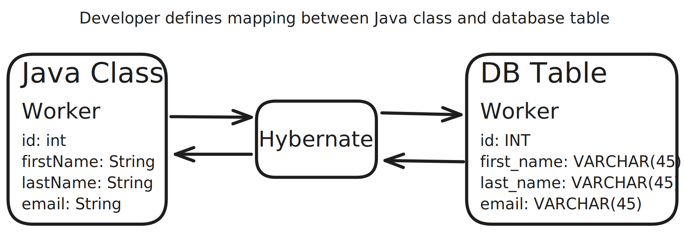

# Hibernate and JPA

## Overview

A framework for persisting Java objects in a relational database. It provides an object-relational mapping (ORM) solution to map Java classes to database tables and vice versa. Hibernate is an implementation of the Java Persistence API (JPA) specification.

## Benefits

1. Handles all the low level SQL.
2. Minimizes the amount of JDBC that I need to write.
3. Provides the Object-Relational Mapping (ORM) framework.



## JPA

JPA (Jakarta Persistence API) is a specification, defined by a set of interfaces, that describes the management of relational data in applications. It provides a standard way to work with databases using Java objects.

## Benefits

1. Standardizes the way I interact with databases. Not vendor locked.
2. Maintain portable, flexible code by coding to the JPA standard.

## JPA Repository and EntityManager

If in need of `low-level` control and flexibility, use the `EntityManager`. If I want to write less code and have more `high-level` control, use the `JPA Repository`.

### EntityManager

Good When:

- Need low level control over the database operations and want to write custom queries.
- Provides low-level access to JPA and work directly with JPA entities.
- Complex queries that required advanced features such as native SQL queries or stored procedure calls.
- When you have custom requirements that are not easily managed by higher level abstractions.

### JPA Repository

Good When:

- Provides commonly used CRUD operations out of the box, reducing the amount of code you need to write.
- Additional features such as pagination...
- Generate queries based on method names.
- Can also create custom queries using `@Query` annotation.

## JPA Query Language (JPQL)

Query language for retrieving entities from the database. It is similar to SQL but operates on `entity name` and `entity fields` as opposed to the direct table names and table columns. Normal keywords like `SELECT`, `FROM`, `WHERE`, `GROUP BY`, `HAVING`, `ORDER BY` are used.

Example of retrieving a student by name:
```java
TypedQuery<Student> query = entityManager.createQuery("SELECT s from Student s WHERE s.name=:name", Student.class);
query.setParameter("name", name);
List<Student> students = query.getResultList();
```
